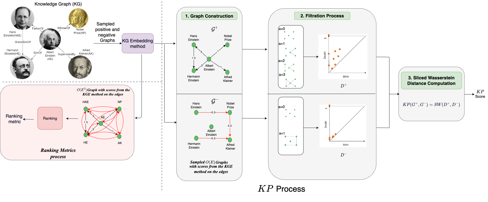

# Can Persistent Homology provide an efficient alternative for Evaluation of Knowledge Graph Completion Methods?

This repository implements the approach, Knowledge Persistence (KP), outlined in the paper "Can Persistent Homology provide an efficient alternative for Evaluation of Knowledge Graph Completion Methods?"

## Short Description about Knowledge Persistence (KP)



Calculating Knowledge Persistence(KP) score from the given KG and KG embedding method is done as follows: The KG is sampled for positive (G+) and negative (G−) triples (step one), keeping the computational complexity linear in the number of nodes. The edge weights represent the score obtained from the KG embedding method. In step two, the persistence diagram (PD) is computed using filtration process. In the final step, a Sliced Wasserstein distance (SW) is obtained between the PDs of G+ and G− to get the KP score.

## Installation

Environment:
```
python=3.7
pytorch=1.6
```

## Steps to compute KP

### Train the KG embedding method (eg: TransE) on a dataset (eg: fb15k_237)
```
cd pykg2vec/
nohup python train.py -ds="fb15k_237" -dsp="/path/to/project/dataset/fb15k_237/" -ts=100 -mn="TransE" -r='/path/to/project/results/summary/TransE/fb15k_237/' -fig='/path/to/project/results/figures/TransE/fb15k_237/' -ep='/path/to/project/results/embeddings/TransE/fb15k_237/' -exp=True -es=False -hpf='/path/to/project/pykg2vec/pykg2vec/hyperparams/params1/TransE.yaml' -device='cuda' > '/path/to/project/results/TransE_fb15k_237.out'
```

#### Make the graphs (positive and negative) from the above learnt method
```
cd pykg2vec/
python make_preds_graphs_allepochs.py --neg_samples -mn='TransE' -d='fb15k_237' -fe='95' -mfol='/path/to/project/results/summary/TransE/fb15k_237/models/' -dsp='/path/to/project/dataset/fb15k_237/' -ifol='/path/to/project/results' -ofol='/path/to/project/results/summary/TransE/fb15k_237/Graphs_neg' -b=1000
```

### Compute the distance between the positive and negative graphs obtained above to get the KP score
```
python compute_distance_bet_neg_graphs_extended.py -r='norm_v3' -pf='/path/to/project/results/summary/TransE/fb15k_237/Graphs_neg_test/preds_pos_95.npz' -npf='/path/to/project/results/summary/TransE/fb15k_237/Graphs_neg_test/preds_neg_95.npz' -org_f='/path/to/project/results/summary/TransE/fb15k_237/Graphs_neg_test/org_95.npz' -of='/path/to/project/results/summary/main_metric_corr/fb15k_237_result_dist_bet_neg_graphs_extended_test_raw.pkl' > '/path/to/project/results/logs/dist_bet_neg_graphs_transe_test_fb15k_237.out'
```

# Citation
If you use our work kindly consider citing

```
@inproceedings{10.1145/3543507.3583308,
author = {Bastos, Anson and Singh, Kuldeep and Nadgeri, Abhishek and Hoffart, Johannes and Singh, Manish and Suzumura, Toyotaro},
title = {Can Persistent Homology Provide an Efficient Alternative for Evaluation of Knowledge Graph Completion Methods?},
year = {2023},
isbn = {9781450394161},
publisher = {Association for Computing Machinery},
address = {New York, NY, USA},
url = {https://doi.org/10.1145/3543507.3583308},
doi = {10.1145/3543507.3583308},
abstract = {In this paper we present a novel method, Knowledge Persistence (), for faster evaluation of Knowledge Graph (KG) completion approaches. Current ranking-based evaluation is quadratic in the size of the KG, leading to long evaluation times and consequently a high carbon footprint. addresses this by representing the topology of the KG completion methods through the lens of topological data analysis, concretely using persistent homology. The characteristics of persistent homology allow to evaluate the quality of the KG completion looking only at a fraction of the data. Experimental results on standard datasets show that the proposed metric is highly correlated with ranking metrics (Hits@N, MR, MRR). Performance evaluation shows that is computationally efficient: In some cases, the evaluation time (validation+test) of a KG completion method has been reduced from 18 hours (using Hits@10) to 27 seconds (using ), and on average (across methods \& data) reduces the evaluation time (validation+test) by ≈ 99.96\%.},
booktitle = {Proceedings of the ACM Web Conference 2023},
pages = {2455–2466},
numpages = {12},
location = {Austin, TX, USA},
series = {WWW '23}
}
```

# Acknowledgements
The [pykg2vec](https://github.com/Sujit-O/pykg2vec) repository has been used for training of the KG embedding methods.
